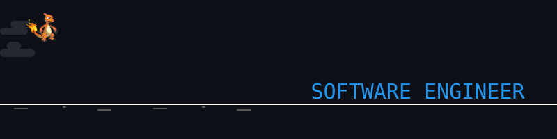
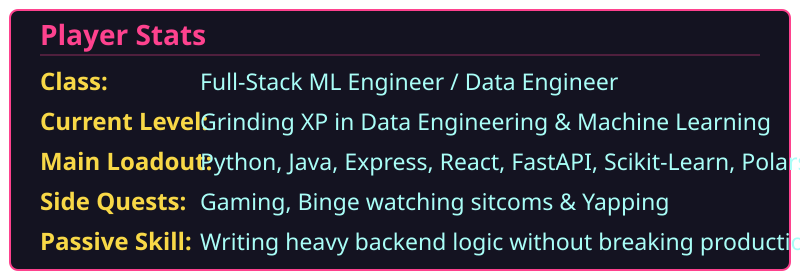

  

 

<h3 align="center">Data & Machine Learning Engineer | Overcoming difficulty spikes in code and Games</h3>

 

  

 

<h3 align="center">Live Server Stats & Activity</h3>

  

 

  
  

 

  

 

<h3 align="center">Tech Stack Inventory</h3>

  <h4>Languages & Frameworks</h4>
  
  
  
  
  
   
   
  
  
  
  
  

  <h4>Data, ML & Infrastructure</h4>
  
  
  
   
   
  
  
  
  
  
  

 

<h3 align="center">Quest Log (Recent Builds)</h3>

  
  
  
  

 

  
  

